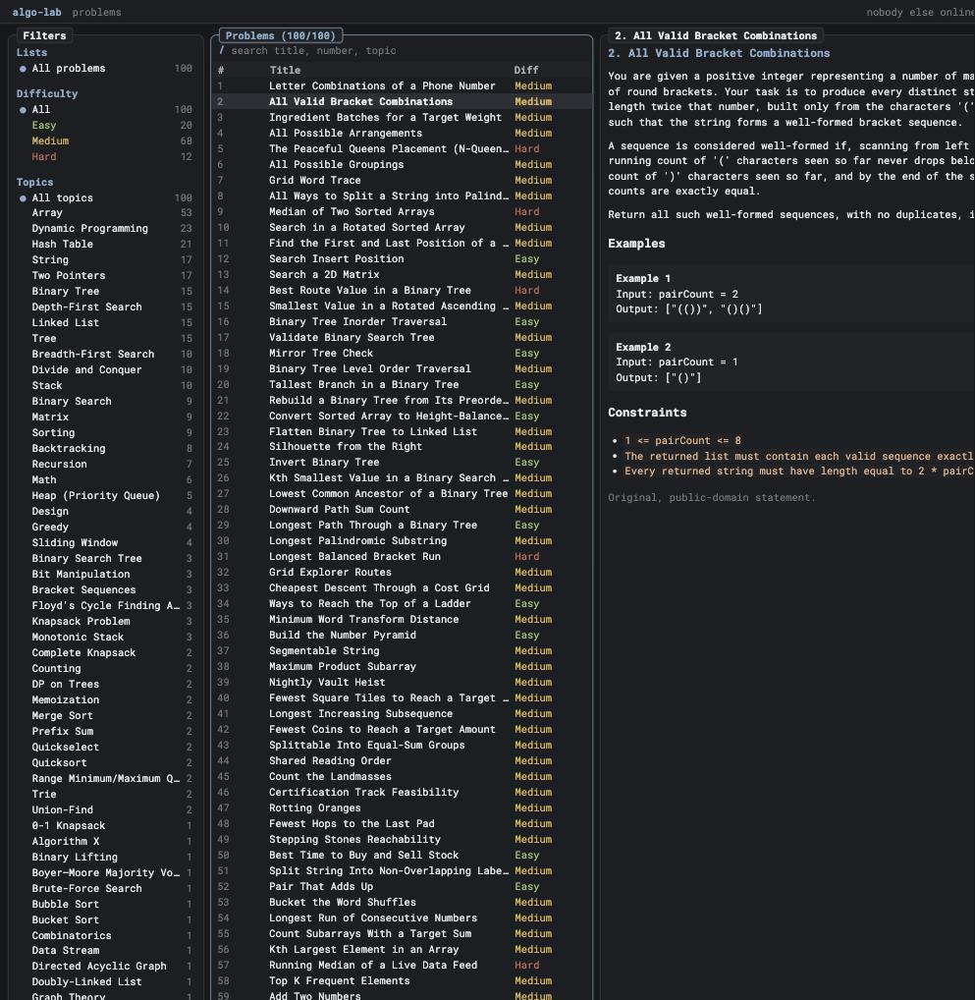
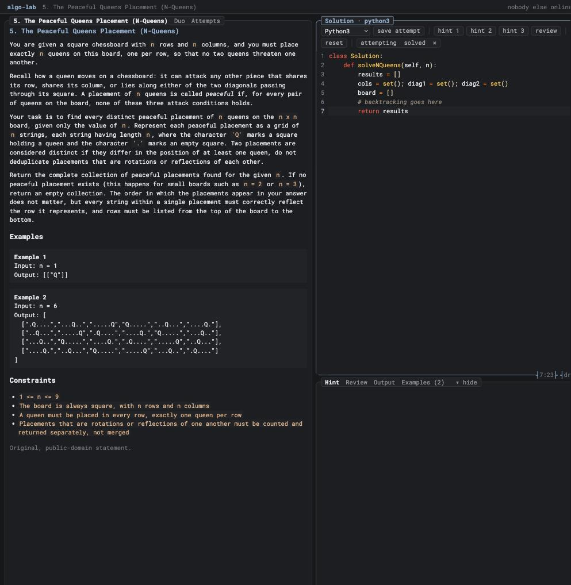

# algo-lab

A self-hosted web app for practicing coding problems, with a terminal-inspired
interface. It ships with **100 common algorithm problems** and runs entirely from a
single Go binary.





## Features

- Browse and filter 100 common algorithm and data-structure problems.
- A syntax-highlighted editor with a scratchpad and a local code runner
  (runs your solution with whatever interpreter/compiler is installed).
- Optional AI hints (three levels) and code review, if an assistant is
  available (see below).
- Per-user accounts, saved attempts, drafts, and progress tracking.
- Live "duo" pairing: work a problem alongside a friend, each in your own
  editor, seeing the other's code as they type.
- Six colour themes.

## Run

```sh
go run .            # http://127.0.0.1:8484, opens your browser
go run . -addr 0.0.0.0:8484 -open=false   # serve on your network
```

The bundled problem set is embedded in the binary, so there is nothing to
download or seed. Accounts and progress live in a small SQLite file
(`-db /path/to/file.db` to choose where).

## AI hints and review (optional)

Hints and review use a local AI CLI if one is present: the `claude` or `codex`
CLI, the Anthropic API (`ANTHROPIC_API_KEY`), or any command you point
`ALGOLAB_AI_COMMAND` at. Without one, those features are simply off; the
rest of the app works normally.

## Problems

The 100 problems are original restatements of well-known interview tasks.
The standalone dataset lives at
<https://github.com/patrickspencer/algorithms>.
